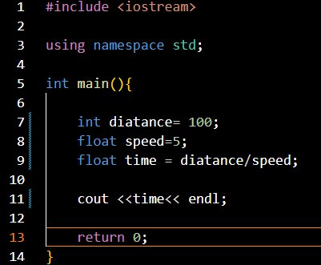

<h3>What is Quality Coding?</h3>

  Quality coding is not rocket science. We use computer programming all the time, and quality coding is related to programming best practices. Let's use a different scenario for easy understanding.

  Imagine cooking your favorite meal, like parippu. The best flavor of parippu comes from following the best cooking practices. First, wash the parippu. Next, add some spices. Then, heat it. This process has specific procedures that, when followed, result in good flavor. Similarly, quality coding involves following procedures to write efficient and understandable code.

<h3>Why Do We Need Code Quality?</h3>

<ul>
  <li>High-quality code allows programs to run efficiently.
    
If we use a lower big(O) value for our code, it runs efficiently.

  </li>
  <li>Makes it easier for teammates to understand and contribute.
    
Clean and quality code is easy to read and understand.

  </li>
  <li>Makes maintenance and future updates smoother, saving time and resources.
    
Clean and quality code can be easily extended and modified.

  </li>
</ul>

<h3>What does poor Code Quality?</h3>

<li>
often leads to technical debt.
</li>
<li>
increased maintenance costs
</li>
<li>
slower software performance
</li>
<li>
higher chance of bugs or crashes.
</li>
<li>
expensive to troubleshoot of bug fix
</li>

<h3>Importance of Writing
Clean Code</h3>

Clean code is code that is easy to 
understand and easy to change.We are writing codes but some time it can't understant we salf .There for we should maintaion clean code consepts

<li>
Speeds up comprehension, saving time
</li>
<li>
Improves maintainability by reducing 
complexity
</li>
<li>
 Facilitates better collaboration among 
developers
</li>
<li>
Fewer bugs and easier debugging
</li>
<li>
Provides structured codebase for future 
scalability
</li>

<h3>How to write Clearn code</h3>

<h4>Naming Conventions</h4>

When programming we are using deffernt naming convetions .( Cammel caseing ,pascal case,Sanke case..) But in bad programming practise do not use any programming naming convention or meaning full naming conventins.  

<h5>Bad exsample</h5>

In this picture we can see variable naming covention is very bad. This is a very simple programme. But we are working in large scale projects that time meaning full naming convetion is very important. Becouse our code is reading many peaple not only you.They should understand easily.

<h5>Good exsample</h5>

 

 
In this exsample we can see what is the perpose of that code lines. That variables represet what type of values they have. There for any person can understand easilly. Otherwise this is a very simple exsample. But some times developers are working in very large projects.That time undertanderbale naming conventions are very usefull.We are working not only alone. Most of the time we are working in teams. Every one should understand that type of good codes easily.There for it is very impotant.  
